### Escuela Colombiana de Ingeniería
### Ciclos de Vida del desarrollo de Software – CVDS

# ServicioBiblioteca

#Descripcion del producto

El producto realizado es una herramienta hecha pensada en las necesidades de la biblioteca de realizar un control y gestión de sus recursos, para así llevarles de manera sencilla y rápida sus servicios a los estudiantes de la Escuela

La aplicación cuenta con una pantalla de inicio en la cual el usuario podrá llenar sus credenciales e ingresar a la aplicación, o podrá ingresar a esta como invitado:
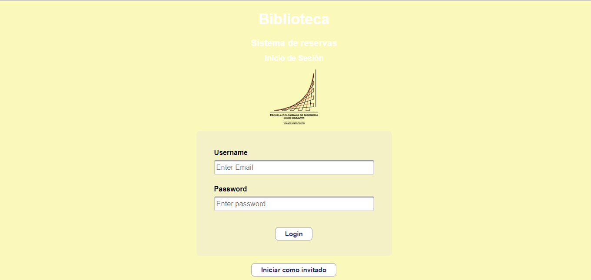

Cuando el usuario que ingresa pertenece a la comunidad de estudiates, se desplegará en la pantalla el siguiente menú 
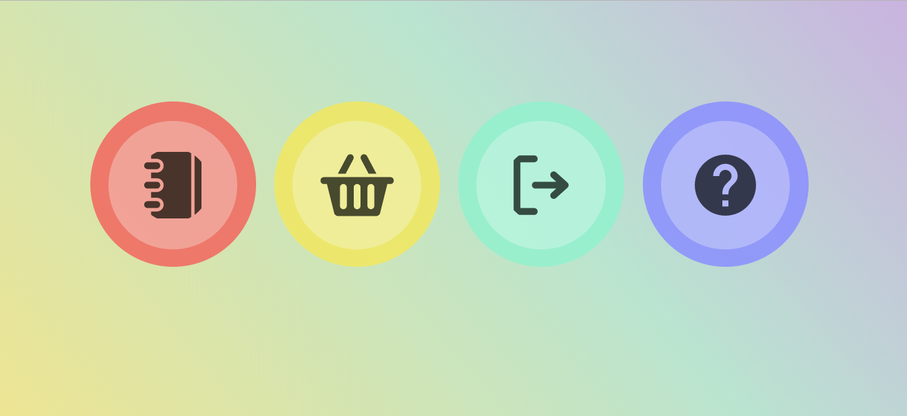

Allí podrá elegir entre dos opciones: ver reservas y ver recursos. 

Cuando el usuario da click en el icono amarrilloz, correspondiente a visualizar recursos, se desplegará en la pantalla el siguiente cuadro:
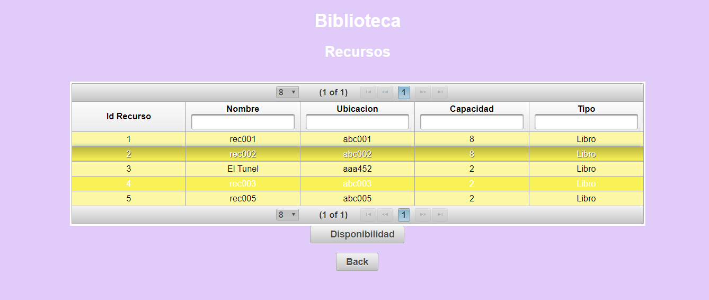

Allí, el usuario podrá observar todos los recursos disponibles con que cuenta la biblioteca y tendrá la posibilidad de filtrar por: nombre, ubicación, capacidad o tipo.
Una vez el usuario ha encontrado el recurso que quiere, podrá dar click sobre el y luego oprimier el botón "Disponibilidad" para observar los horarios del recurso.
Una vez el usuario oprimido el botón de "Disponibilidad", aparecerá en la pantalla un calendario con la información del recurso. En este se podrá observar las horas en que el recursos está libre y en las que no.
Este calendario cuenta con tres vistas:
- Mensual
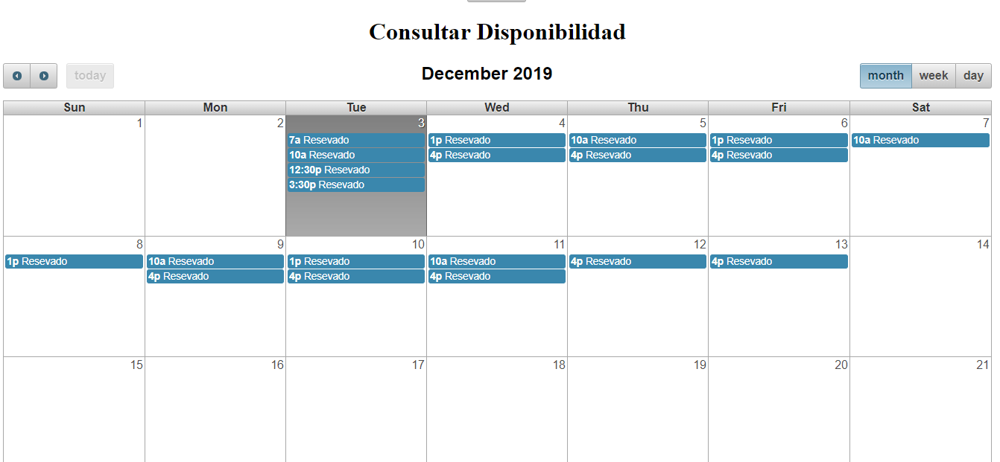
- Semanal
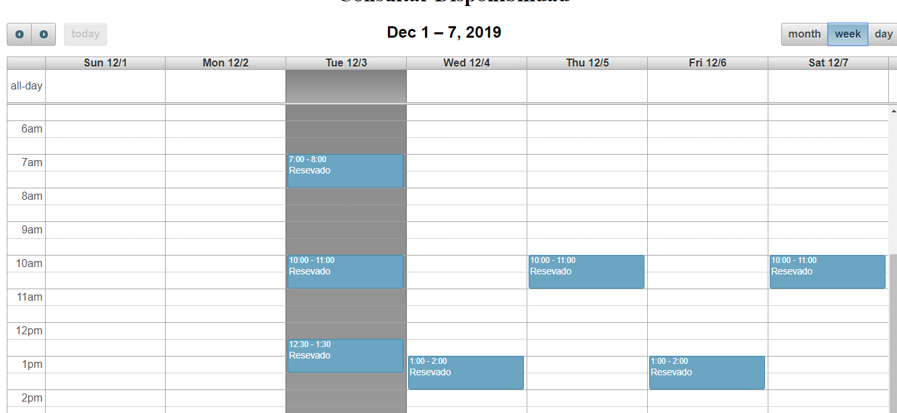
- Del día
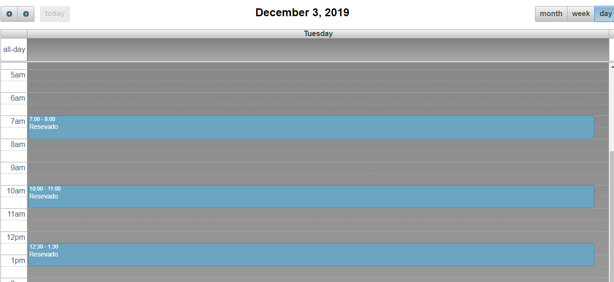

Además, esta vista también le permite al usuario obtener información de las reservas con que cuenta el recurso. Para esto, basta que el usuario oprima click sobre cualquier reserva mostrada en el horario, e inmediatamente, aparecerá toda la información de esta de la siguiente manera:

Y como último elemento en esta vista, el usuario podrá realizar sus reservas allí. Basta con que oprima un espacio en el horario, o el día en que prefiera realizar la reserva. Cuando el usuario selecciona el día, esto en la vista de "disponibilidad mensual", se desplegará el siguiente formulario, solicitandole que digite: la hora, duración y si desea hacer una reserva concurrente:
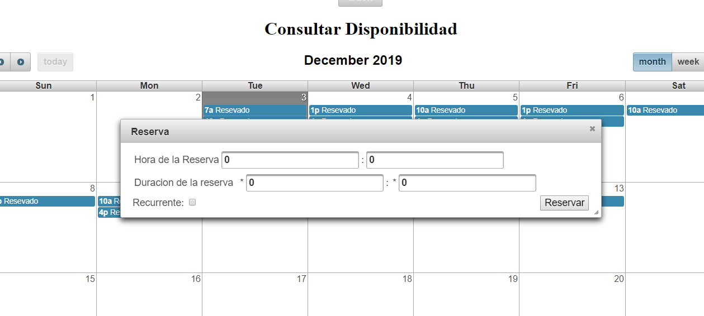

Mientras que si el usuario realiza esta selección en una hora específica, ya sea que lo haga desde la vista de "disponibilidad semanal" o "disponibilidad diaría", el usuario no tendrá que digitar la hora, ya que esta tomará el valor de la franja donde realizó el click
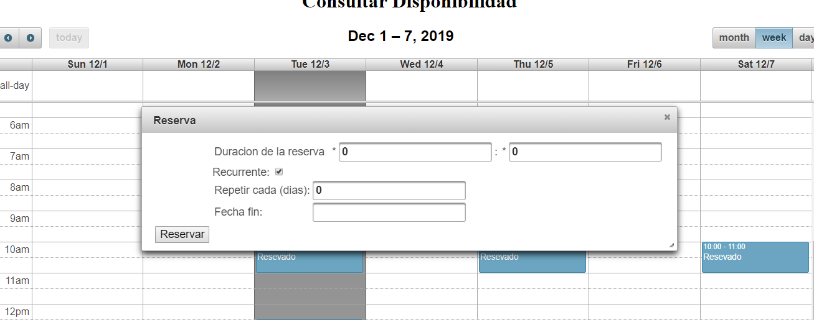

Mientras que si el usuario realiza esta selección en una hora específica, ya sea que lo haga desde la vista de "disponibilidad semanal" o "disponibilidad diaría", el usuario no tendrá que digitar la hora, ya que esta tomará el valor de la franja donde realizó el click

Una vez el usuario haya hecho sus reservas o consultado las mismas, podrá abandonar la aplicación volviendo al menú incial y oprimiendo el ícono rojo.

Cuando el que ingresa a la aplicación es un usuario administrador, el menú a desplegar será el siguiente:

Allí el admin, oprimiendo el primer ícon de izquierda a derecha, podrá registrar un nuevo usuario a la aplicación llenando el siguiente formulario:
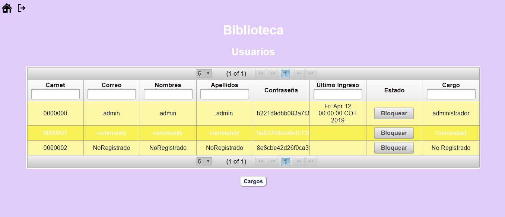

Oprimiendo el segundo, el administrador se encontrará con una información detallada de cada una de las reservas hechas en la aplicación:
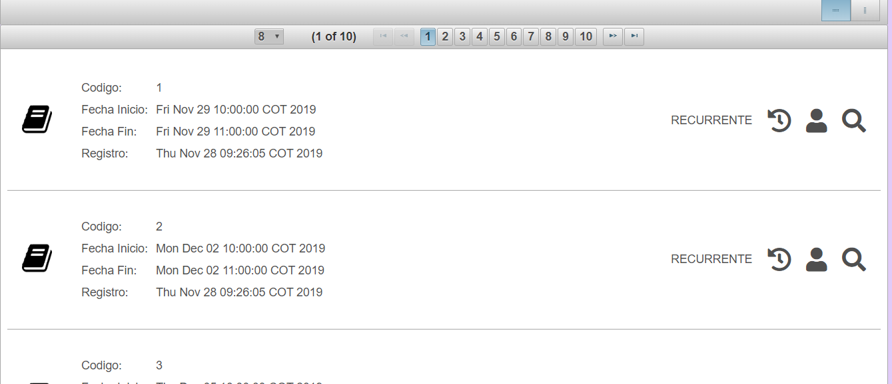

Si el administrador desea obtener información más detallada sobre el recurso reservado, bastará con que oprima el ícono de la lupa e inmediatamente se desplegará en un cuadro toda la información sobre dicho recurso:
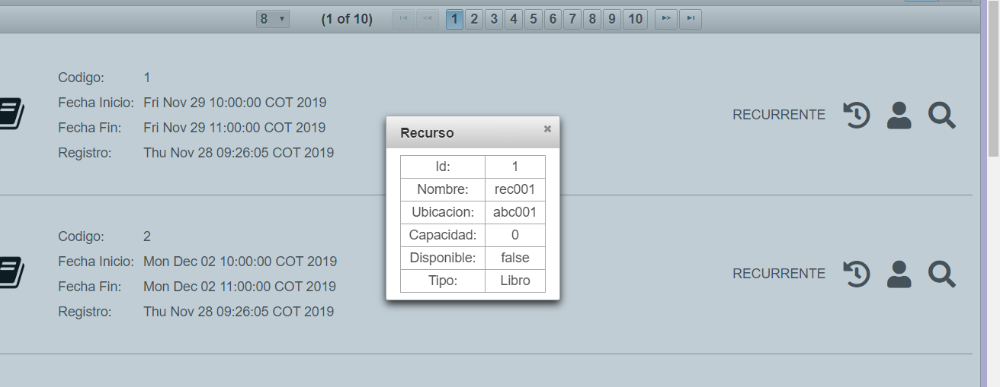

Por otra parte, si desea ver una información detallada del usuario al cual pertenece la reserva, bastará con oprimir el muñeco de usuario:
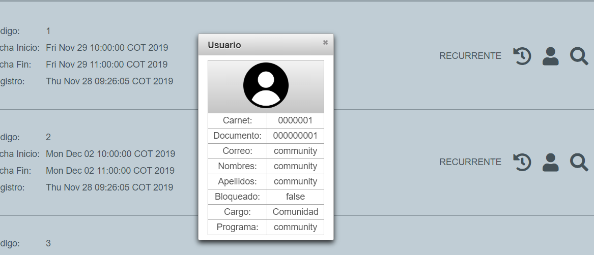

Finalmente, si se tratase de una reserva recurrente, el administrador podrá ver la próxima fecha y la fecha final de esta oprimiento el último ícono:
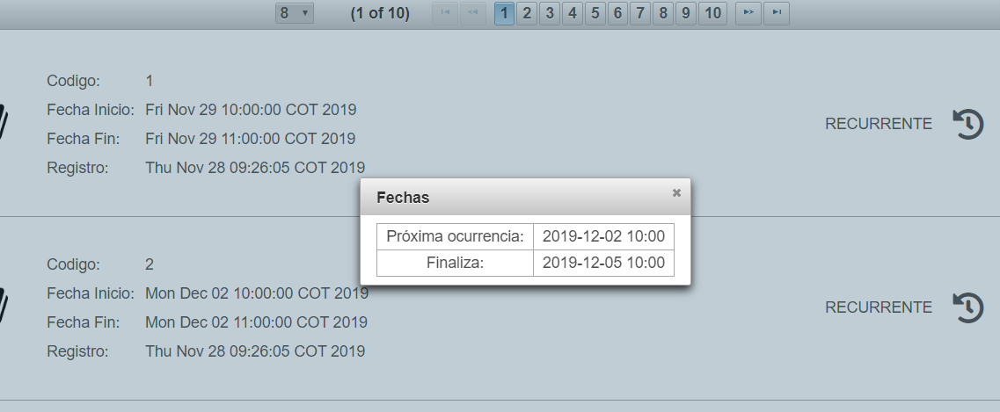

Otra de las funcionalidades que ofrece este menú de administrador es la de gestionar los recursos. Para esto, el administrador deberá oprimir en el ícono verde del menú principal, allí se desplegará la siguiente pantalla, la cual le permitirá al administrador ingresar un nuevo recurso a la aplicación:
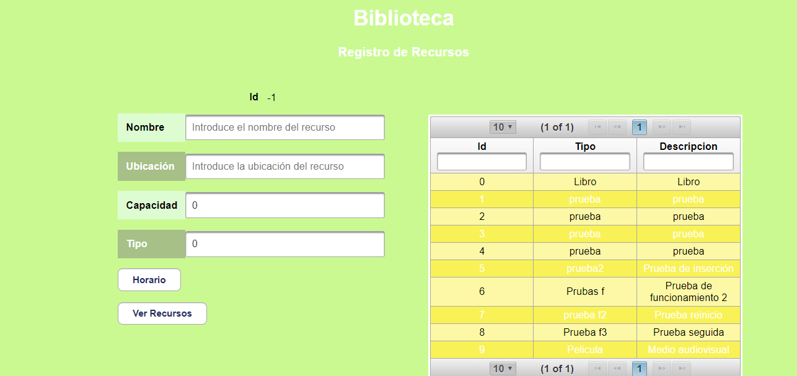
 
Allí mismo, oprimiendo el botón de "ver recursos", podrá gestionar los recursos actuales, bloqueandolos si es necesario:
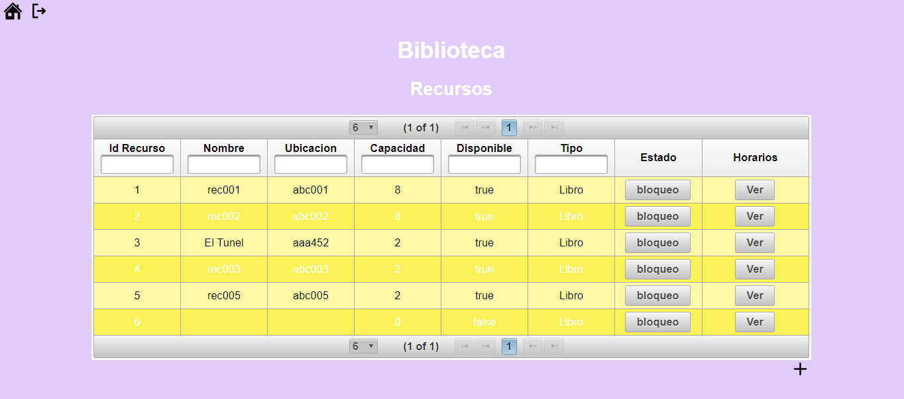

Por último, el administrado podrá gestionar los tipos de recurso de la aplicación. Esto oprimiendo el cuarto ícono de izquierda a derecha. Haciendo esto, se desplegará la siguiente vista, donde podrá ver los tipos existentes y agregar un nuevo tipo si lo desea:
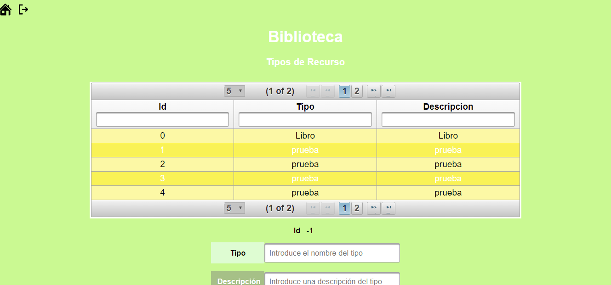

Cuando un usuario elige la opción de ingresar como invitado, se topará con la tabla de recursos disponibles vista anteriormente. Allí, de igual forma que el usuario de la comunidad, podrá elegir el recurso que desee y observar su disponibilidad, además, de obtener una pequeña información de las reservas de este. 
La gran diferencia en esta vista, radica en que, si el usuario invitado oprime una hora o día en el calendario para realizar una reserva, aparecerá ante él el siguiente cuadro solicitandole iniciar sesión para poder realizar esta reserva:
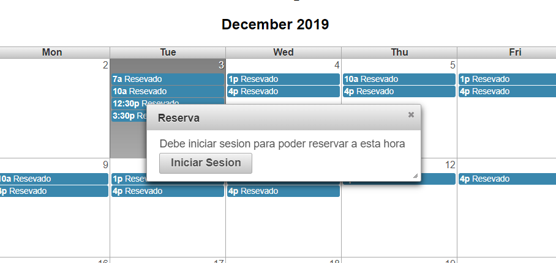

# Diagrama Base de datos

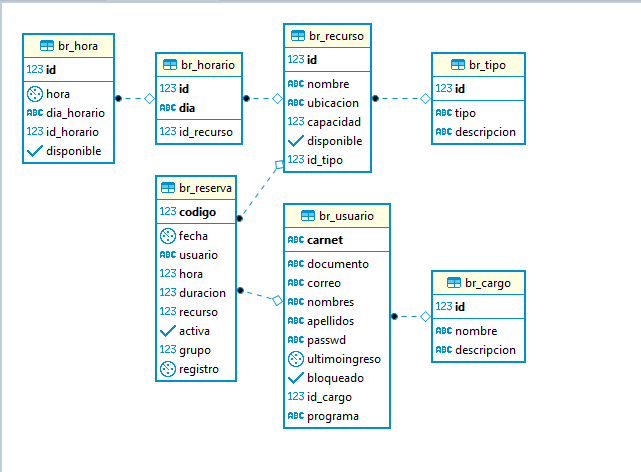

# Diagrama de Clases

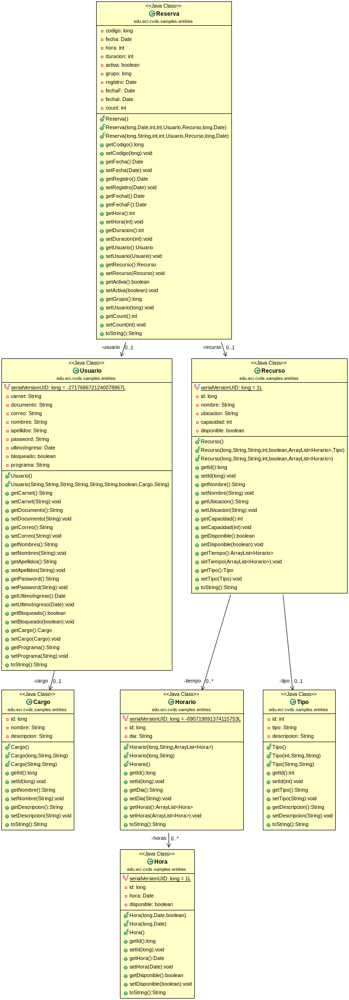

HEROKU LINKS:

https://serviciobiblioteca.herokuapp.com/

https://proyecto-biblioteca.herokuapp.com/

